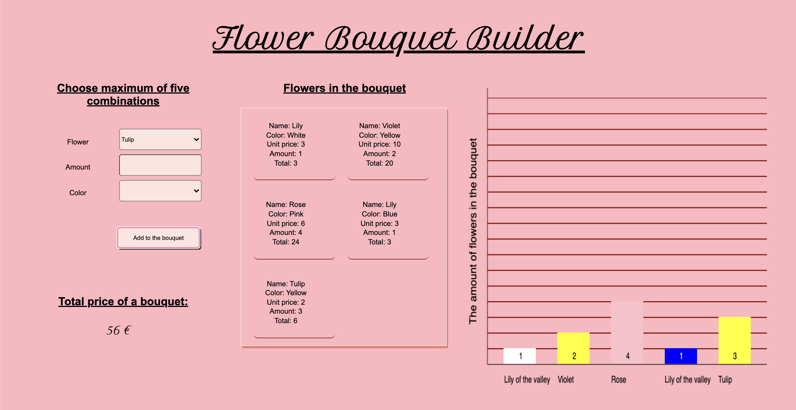

# Flower Bouquet

Enter terminal (Bash) command lines:

1. cd src
2. cd server
3. node server.js
4. Open new terminal (Bash)
5. npm start
6. Copy the address to a browser.

This is a Business College Helsinki school project with Vanilla Javascript, HTML5 and CSS3.

## Screenshot

